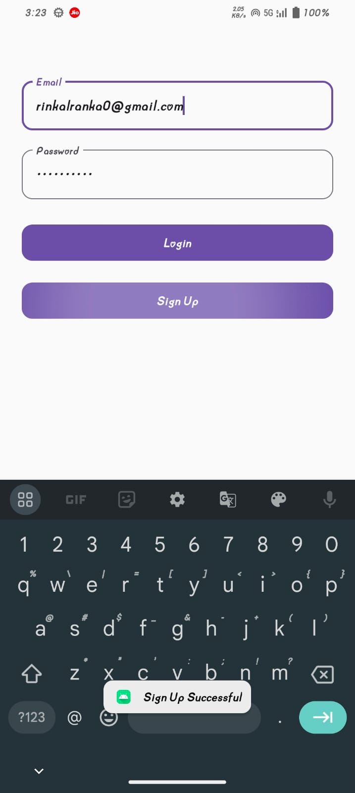

# 🔐 Firebase Authentication App

A simple Android app built to learn Firebase Authentication using Kotlin.

# 📌 Features

User Registration with email and password.

User Login with email and password.

Password Reset functionality.

Logout for authenticated users.

Real-time authentication status using FirebaseAuth.

# UI SCREEN

### LOGIN-SIGNUP SCREEN

# 🛠️ Tech Stack

Language: Kotlin

Authentication: Firebase Authentication

UI: Material Components, EditText, Button

# 🚀 Usage

Open the project in Android Studio.

Connect your app to a Firebase project.

Add Firebase Authentication (Email/Password) in the Firebase console.

Run the app on a device or emulator.

Register a new user or login with an existing account.

# 🔮 Future Improvements

Add Google & Phone authentication.

Add email verification.

Integrate Firestore for user profile data.

Add forgot password email feature with custom UI.
